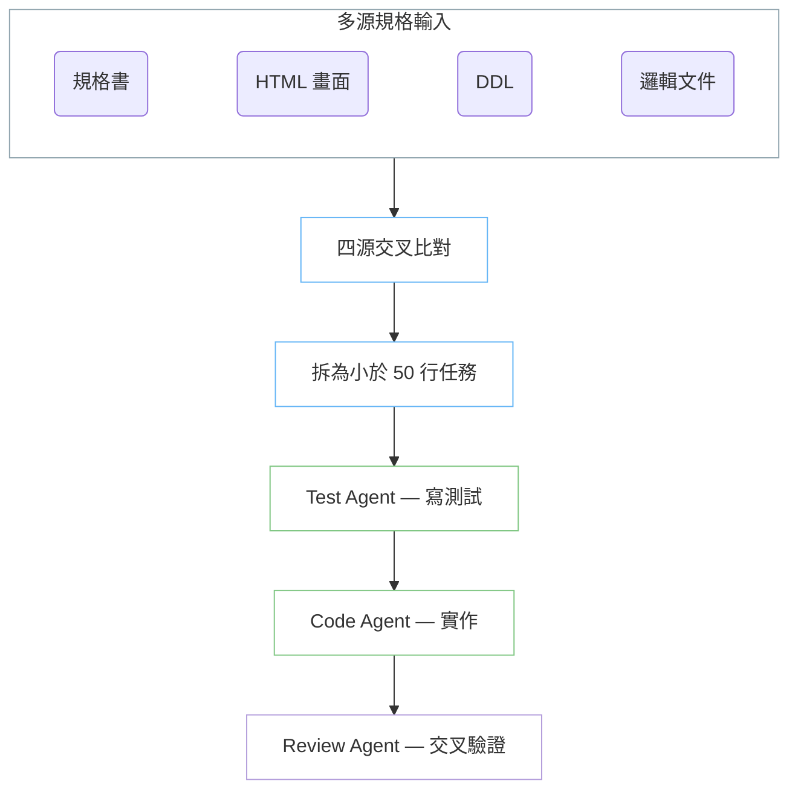
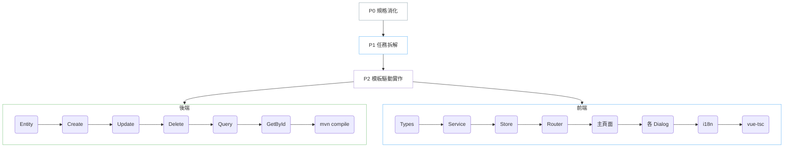
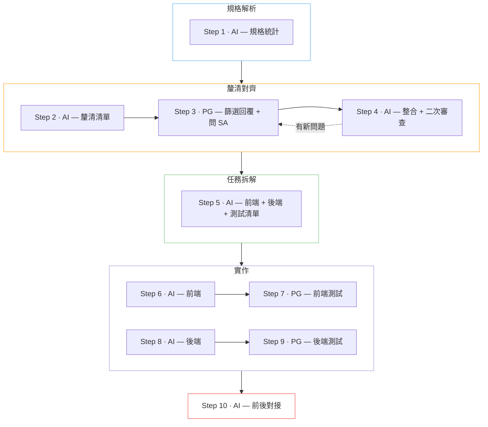
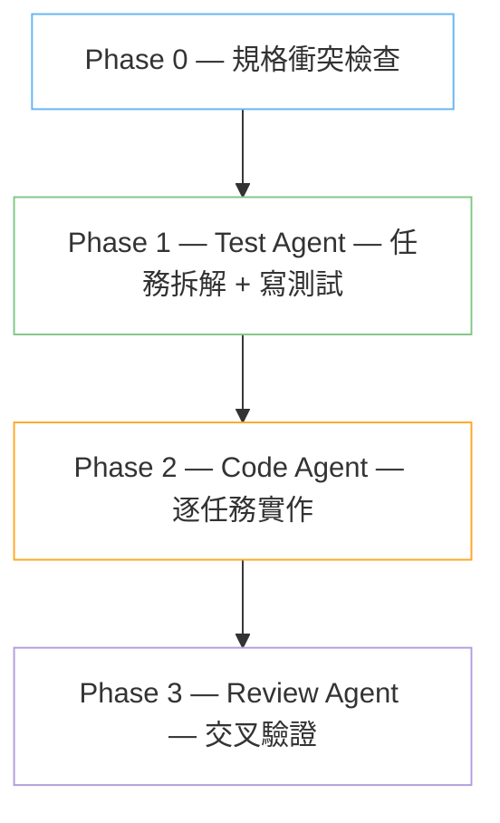
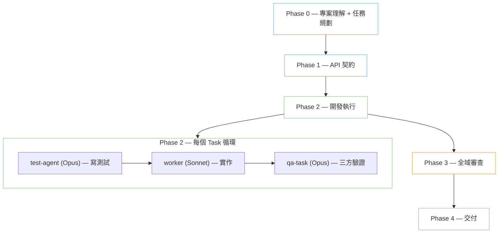

# soetek-agentic-coding-skills

以 LLM 行為特性實證研究為基礎的 Claude Code Skills 集合。
結構性防禦優於指令性約束 — 每條規則都有量化研究支撐。

## 安裝

在 Claude Code 中加入此 repo 作為 plugin source：

```
Plugin URL: https://github.com/soetek/soetek-agentic-coding-skills
```

加入後即可在 skill 清單中看到所有可用的 skills，選擇性安裝。

## Skill Catalog

| Skill | 狀態 | 適用場景 | 說明 |
|-------|------|---------|------|
| [eap-agentic-coding](skills/eap-agentic-coding/) | **實測中** | eap 專案（Quarkus + Vue 3 + MSSQL） | 規格驅動開發：多源規格交叉比對 → 任務拆解 → test-first → agent 分離實作 → 交叉驗證 |
| [eap-agentic-coding-lite](skills/eap-agentic-coding-lite/) | **實測中** | eap 專案（Demo 用） | 規格驅動開發：同一 session 連續執行 P0→P1→P2，模板驅動實作 |
| [spec-digest-flow](skills/spec-digest-flow/) | **v1.0.0** | 通用（SA 規格書消化） | PG 接到 SA 規格書後的標準流程：規格統計 → 釐清清單 → SA 回覆整合 → 任務清單，含 Prompt 模板與輸出模板 |
| [serp-agentic-coding](skills/serp-agentic-coding/) | 暫停 | serp 專案 | 原型骨架，待 eap 實測結論回饋後迭代 |

---

### eap-agentic-coding



---

### eap-agentic-coding-lite



---

### spec-digest-flow



---

### serp-agentic-coding



## 相關 Skill 專案

| 專案 | 說明 |
|------|------|
| [TouchFish-DevTeam](https://github.com/agony1997/TouchFish-DevTeam) | 多角色 Agent 團隊協作 — TL (Opus) 指揮 Workers (Sonnet) 並行開發，分離測試 + 三方交叉驗證 QA |
| [TouchFish-Skills](https://github.com/agony1997/TouchFish-Skills) | 4 個專案基礎設施插件 — DDD 分析模板、Git 全方位專家、專案規範審查、專案探索者 |

### TouchFish-DevTeam



## 研究基礎

這些 skills 的設計規則追溯至以下實證研究，非經驗談：

| 文件 | 內容 |
|------|------|
| [01 LLM 行為特性研究彙整](01_LLM_行為特性研究彙整.md) | 11 項 LLM 行為風險 + 量化證據（語義漂移、Context Rot、模式複製、規格博弈等） |
| [01 摘要](01_摘要.md) | 上述研究的萃取摘要 |
| [02 Skill 設計原則](02_Skill設計原則_Thariq_Anthropic.md) | Anthropic 工程師 Thariq 的 9 項 Skill 設計原則 |
| [03 Harness Engineering](03_Harness_Engineering_HumanLayer.md) | HumanLayer 的 7 項 Harness Engineering 原則 + 反模式 |
| [review/](review/) | Skills 的多輪交叉審查報告 |

## 設計原則

- **AI 做執行，人做判斷** — 每個 Phase 有明確的人類決策點（STOP Gate）
- **信噪比 > 總量** — conventions 和 templates 按需載入，不一次全灌
- **回饋迴路決定自主上限** — 測試、lint、型別檢查提供 pass/fail 信號
- **研究 → Skill 直接推導** — 不設中間抽象層，減少語義漂移
