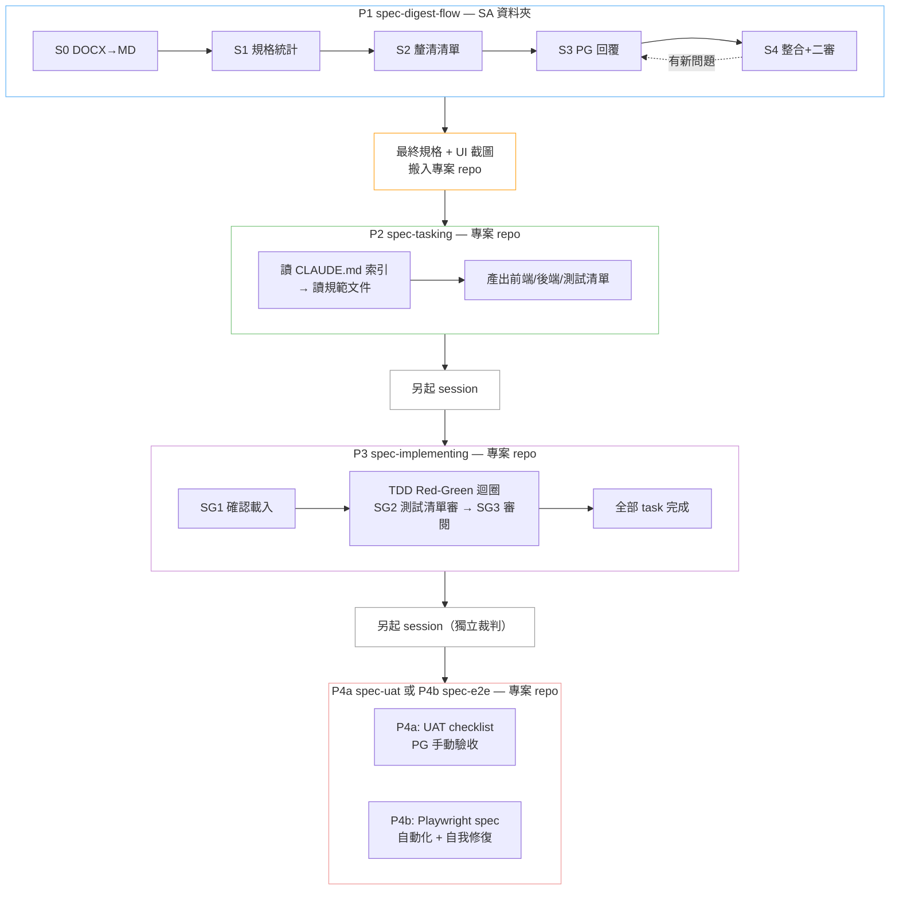
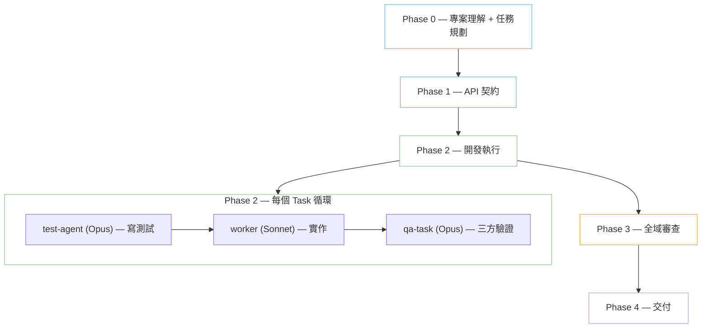

# soetek-agentic-coding-skills

以 LLM 行為特性實證研究為基礎的 Claude Code Skills 集合。
結構性防禦優於指令性約束 — 每條規則都有量化研究支撐。

## 安裝

在 Claude Code 中加入此 repo 作為 plugin source：

```
Plugin URL: https://github.com/soetek/soetek-agentic-coding-skills
```

加入後即可在 skill 清單中看到所有可用的 skills，選擇性安裝。

## Skill Catalog

### 通用型 SKILL（P1–P4b）

| Skill | 版本 | 觸發 | 說明 |
|-------|------|------|------|
| [spec-digest-flow](skills/spec-digest-flow/) | v1.2.0 | `/spec` | P1 — SA 規格書消化 S0–S4：DOCX 轉 MD → 規格統計 → 釐清清單 → SA 回覆整合 |
| [spec-tasking](skills/spec-tasking/) | v2.0.0 | `/tasking` | P2 — 於專案 repo 內讀 CLAUDE.md 索引取得規範，依最終版規格統計產出前後端與測試任務清單 |
| [spec-implementing](skills/spec-implementing/) | v1.0.0 | `/impl` | P3 — TDD 驅動實作：Red-Green 迴圈逐 task 實作 + 單元測試，三道 stop gate 確保品質 |
| [spec-uat](skills/spec-uat/) | v1.0.0 | `/uat` | P4a — 人工驗收測試：讀 test_cases.md 產 UAT checklist，PG 逐項勾選，彙總報告 |
| [spec-e2e](skills/spec-e2e/) | v1.0.0 | `/e2e` | P4b — Playwright 自動化 E2E：產 Playwright spec + 自我修復 + 三層防護 |

### 暫停的特化 SKILL

| Skill | 版本 | 說明 |
|-------|------|------|
| [eap-agentic-coding](skills/eap-agentic-coding/) | v1.7.0 | eap 專案規格驅動開發（Quarkus + Vue 3 + MSSQL），已被通用型路線取代 |
| [eap-agentic-coding-lite](skills/eap-agentic-coding-lite/) | v2.0.0 | eap 規格驅動開發 Demo 版，已被通用型路線取代 |
| [serp-agentic-coding](skills/serp-agentic-coding/) | v1.2.0 | serp 專案規格驅動開發，已被通用型路線取代 |

### 工具型 SKILL

| Skill | 版本 | 觸發 | 說明 |
|-------|------|------|------|
| [session-analyzer](skills/session-analyzer/) | v1.0.0 | `/session-analyzer` | 分析 Claude Code session 的 token 用量、時間、sub-agent 明細 |

> 各 skill 的流程圖與詳細說明請見各自資料夾下的 README。

---

### 通用型 SKILL 完整流程



## 相關 Skill 專案

| 專案 | 說明 |
|------|------|
| [TouchFish-DevTeam](https://github.com/agony1997/TouchFish-DevTeam) | 多角色 Agent 團隊協作 — TL (Opus) 指揮 Workers (Sonnet) 並行開發，分離測試 + 三方交叉驗證 QA |
| [TouchFish-Skills](https://github.com/agony1997/TouchFish-Skills) | 4 個專案基礎設施插件 — DDD 分析模板、Git 全方位專家、專案規範審查、專案探索者 |

### TouchFish-DevTeam



## 研究基礎

這些 skills 的設計規則追溯至以下實證研究，非經驗談：

| 文件 | 內容 |
|------|------|
| [01 LLM 行為特性研究彙整](01_LLM_行為特性研究彙整.md) | 11 項 LLM 行為風險 + 量化證據（語義漂移、Context Rot、模式複製、規格博弈等） |
| [01 摘要](01_摘要.md) | 上述研究的萃取摘要 |
| [02 Skill 設計原則](02_Skill設計原則_Thariq_Anthropic.md) | Anthropic 工程師 Thariq 的 9 項 Skill 設計原則 |
| [03 Harness Engineering](03_Harness_Engineering_HumanLayer.md) | HumanLayer 的 7 項 Harness Engineering 原則 + 反模式 |
| [04 通用型 SKILL 架構設計](04_通用型SKILL架構設計.md) | 5 SKILL 架構（P1–P4b）+ 11 項設計決策記錄 + CLAUDE.md 契約 |
| [review/](review/) | Skills 的多輪交叉審查報告 |

## 設計原則

- **AI 做執行，人做判斷** — 每個 Phase 有明確的人類決策點（STOP Gate）
- **信噪比 > 總量** — conventions 和 templates 按需載入，不一次全灌
- **回饋迴路決定自主上限** — 測試、lint、型別檢查提供 pass/fail 信號
- **研究 → Skill 直接推導** — 不設中間抽象層，減少語義漂移
- **讀規範、不掃 code** — 專案 context 來自 CLAUDE.md 索引指向的規範文件（deterministic），不掃 code 歸納 pattern（AI 行為會漂移）
