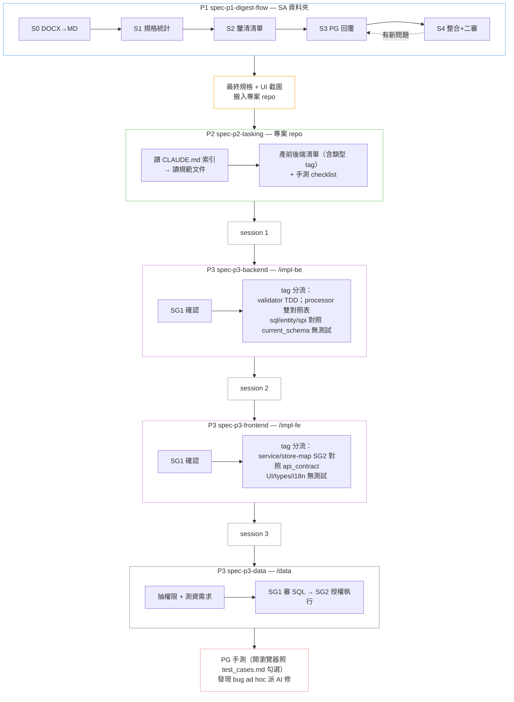

# soetek-agentic-coding-skills

以 LLM 行為特性實證研究為基礎的 Claude Code Skills 集合。
結構性防禦優於指令性約束 — 每條規則都有量化研究支撐。

## 安裝

在 Claude Code 中加入此 repo 作為 plugin source：

```
Plugin URL: https://github.com/soetek/soetek-agentic-coding-skills
```

加入後即可在 skill 清單中看到所有可用的 skills，選擇性安裝。

## Skill Catalog

### 通用型 SKILL（P1 → P2 → P3-backend → P3-frontend → P3-data → PG 手測）

| Skill | 版本 | 觸發 | 說明 |
|-------|------|------|------|
| [spec-p1-digest-flow](skills/spec-p1-digest-flow/) | v1.2.0 | `/spec` | P1 — SA 規格書消化 S0–S4：DOCX 轉 MD → 規格統計 → 釐清清單 → SA 回覆整合 |
| [spec-p2-tasking](skills/spec-p2-tasking/) | v3.0.0 | `/tasking` | P2 — 於專案 repo 內讀 CLAUDE.md 索引，產前後端任務清單（含類型 tag）+ 手測 checklist |
| [spec-p3-backend](skills/spec-p3-backend/) | v1.0.0 | `/impl-be` | P3-backend — 後端實作：`[validator]` 完整 TDD；`[processor]` 走 SG2 雙對照表（api_contract A## + current_schema，無 mock-based 測試）；`[sql]`/`[entity]`/`[spi]` 對照 current_schema 後寫實作無測試 |
| [spec-p3-frontend](skills/spec-p3-frontend/) | v1.0.0 | `/impl-fe` | P3-frontend — 前端實作：`[service]`/`[store-map]` 走 SG2 對照 api_contract A##（無 mock-based 測試），其他類（UI/types/i18n）無測試由 PG 完工後整體手測 |
| [spec-p3-data](skills/spec-p3-data/) | v1.0.0 | `/data` | P3-data — 權限 SQL + 測試資料 SQL 產出與執行，PG 授權後跑 |

### 工具型 SKILL

| Skill | 版本 | 觸發 | 說明 |
|-------|------|------|------|
| [session-analyzer](skills/session-analyzer/) | v1.0.0 | `/session-analyzer` | 分析 Claude Code session 的 token 用量、時間、sub-agent 明細 |

> 各 skill 的流程圖與詳細說明請見各自資料夾下的 README / SKILL.md。

---

### 通用型 SKILL 完整流程



## 相關 Skill 專案

| 專案 | 說明 |
|------|------|
| [TouchFish-DevTeam](https://github.com/agony1997/TouchFish-DevTeam) | 多角色 Agent 團隊協作 — TL (Opus) 指揮 Workers (Sonnet) 並行開發，分離測試 + 三方交叉驗證 QA |
| [TouchFish-Skills](https://github.com/agony1997/TouchFish-Skills) | 4 個專案基礎設施插件 — DDD 分析模板、Git 全方位專家、專案規範審查、專案探索者 |

## 研究基礎

這些 skills 的設計規則追溯至以下實證研究，非經驗談：

| 文件 | 內容 |
|------|------|
| [01 LLM 行為特性研究彙整](01_LLM_行為特性研究彙整.md) | 11 項 LLM 行為風險 + 量化證據（語義漂移、Context Rot、模式複製、規格博弈等） |
| [01 摘要](01_摘要.md) | 上述研究的萃取摘要 |
| [02 Skill 設計原則](02_Skill設計原則_Thariq_Anthropic.md) | Anthropic 工程師 Thariq 的 9 項 Skill 設計原則 |
| [03 Harness Engineering](03_Harness_Engineering_HumanLayer.md) | HumanLayer 的 7 項 Harness Engineering 原則 + 反模式 |
| [04 通用型 SKILL 架構設計](04_通用型SKILL架構設計.md) | 5 SKILL 架構 + 設計決策記錄 + CLAUDE.md 契約 |
| [review/](review/) | Skills 的多輪交叉審查報告 |

## 設計原則

- **AI 做執行，人做判斷** — 每個 Phase 有明確的人類決策點（STOP Gate）
- **信噪比 > 總量** — conventions 和 templates 按需載入，不一次全灌
- **回饋迴路決定自主上限** — 測試、lint、型別檢查提供 pass/fail 信號
- **研究 → Skill 直接推導** — 不設中間抽象層，減少語義漂移
- **讀規範、不掃 code** — 專案 context 來自 CLAUDE.md 索引指向的規範文件（deterministic），不掃 code 歸納 pattern（AI 行為會漂移）
- **類型 tag 驅動測試策略** — P2 在 task 標 tag，P3 依 tag 分流（邏輯 heavy 走 TDD，UI heavy 走手測）
- **手測優先於自動化 E2E** — UI/UX/文字/樣式問題人眼 1 秒看出，寫 E2E 投入產出比低
